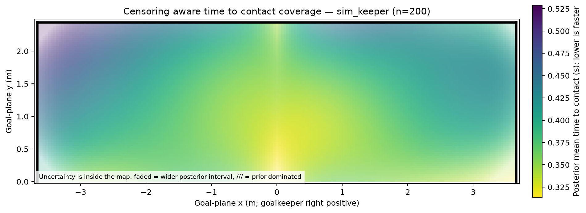
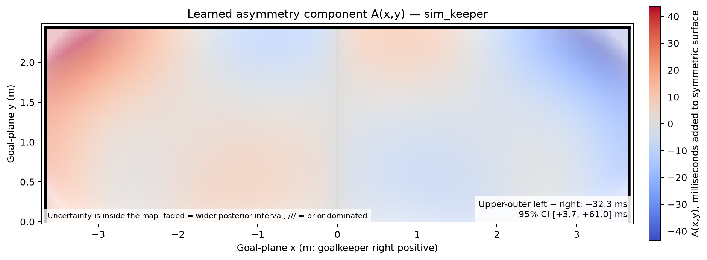

# Goalkeeper Coverage Surface — Penalty-Kick Prototype

[](https://github.com/violethawk/gk-cov-map/actions/workflows/tests.yml)

Estimates how quickly a goalkeeper reaches each point of the goal mouth, from manually annotated penalty clips, and reports whether they are measurably slower to one side. Everything runs locally; no cloud service is used.

The awkward part is that **most penalties are never touched**. A shot that goes in tells you the keeper failed to reach that point in time — not how long reaching it would have taken. Fitting only the shots the keeper actually touched discards that evidence and makes the keeper look faster than they are — worst of all in the corners, where touches are rarest and the honest answer matters most. This prototype keeps every shot, treating an untouched one as a right-censored observation: a goal contributes `P(T > flight time)` rather than nothing at all.



Posterior mean time to contact. Darker is slower. Uncertainty is drawn *inside* the map rather than relegated to a table: faded regions have wider intervals, and `///` marks where the prior rather than the data is driving the estimate.



The report's headline claim is the left/right contrast, always stated with an interval rather than as a point estimate.

Both images come from the [quick start](#quick-start) below, so you can reproduce them before annotating anything.

## What you need

- **Python 3.11 or newer.**
- **Clips**: constant-frame-rate MP4s, one keeper per fit. Variable-frame-rate files are blocked rather than guessed at, and must be transcoded first.
- **A Chromium browser** for the annotation tool, which appends via the File System Access API.
- **Enough shots.** Below 150 every output carries a `PRIOR-DOMINATED SMALL-SAMPLE MODE` banner and uses deliberately wider priors. Below roughly 40, some fits are refused outright rather than reported — see [One-command report](#one-command-report).

## Install

```bash
python3.11 -m venv .venv
source .venv/bin/activate
python -m pip install -e .
```

## Quick start

No clips required — this renders the images above from simulated annotations:

```bash
gkcoverage simulate --n 200 --seed 1 --output penalties.jsonl
gkcoverage run --input penalties.jsonl --keeper-id sim_keeper --output outputs/demo
```

Open `outputs/demo/report.html`. To work with real footage, replace the `simulate` step with the annotation tool below.

## Annotation tool

Serve the directory locally in Chromium:

```bash
python -m http.server 8000 -d annotation_tool
```

Open `http://localhost:8000`, choose an MP4 clip, and choose/create the append-only JSONL file. Keyboard controls:

- Left/right arrow: ±1 frame
- Shift + left/right: ±5 frames
- Space: play/pause

The app reads MP4 timing from `mdhd` and `stts`; it never assumes 24/25/30/60 FPS. Variable-frame-rate files are blocked and must be transcoded to constant frame rate.

### Synthetic round-trip clip

Use:

- `examples/synthetic_penalty_30fps.mp4`
- `examples/synthetic_expected.json`

Expected strike frame: 20. Expected crossing frame: 32. Expected flight time: 0.400 s.

## One-command report

```bash
gkcoverage run \
  --input penalties.jsonl \
  --keeper-id keeper_1 \
  --output outputs/keeper_1
```

Outputs:

- `coverage_surface.png` — censoring-aware posterior mean with uncertainty fading and prior-dominated hatching
- `asymmetry_surface.png` — `A(x,y)` centered at zero with an interval-bounded upper-left vs upper-right statement
- `raw_overlay.png` — all crossing points, constant marker size, colored by outcome
- `displacement_velocity.png` — companion displacement-velocity surface
- `surface_grid.csv` — render-time samples with mean, SD, interval, and prior-dominance fields
- `summary.json` — asymmetry estimates and uncertainty scope
- `report.html` — standalone report with embedded images

For `n < 150`, every model output carries a **PRIOR-DOMINATED SMALL-SAMPLE MODE** banner and uses deliberately wider priors.

Below roughly 40 shots some samples are refused outright rather than reported: if the fitted residual scale reaches its bound it is constrained rather than estimated, and the reported intervals are Laplace approximations that assume an interior optimum. These are also the worst-calibrated fits — at `n=20`, fits that reach the bound cover the true surface far below the nominal 95%, while fits whose scale stays interior cover at about nominal — so `gkcoverage run` raises with the observed scale and sample size instead of drawing a map.

## Simulation validation

Generate synthetic annotations:

```bash
gkcoverage simulate --n 200 --seed 1 --output examples/simulated_200.jsonl
```

Run the required 20-run gate:

```bash
gkcoverage validate --runs 20 --n 200
```

The deterministic acceptance test currently recovers the correct asymmetry sign in 20/20 runs and covers the true magnitude in 20/20 stated 95% intervals. Over 100 runs the contrast interval covers 99 times, so it is mildly conservative rather than exact.

## Tests

```bash
pytest -m "not slow"
pytest -m slow
```

The slow test is the 20-run simulation acceptance test and is intentionally included in pytest rather than left as an ad hoc script.

## How it works

### 1. Coordinate system

The statistical goal plane is **7.32 m × 2.44 m**, with origin at bottom-center. Positive `x` points to the goalkeeper's right as viewed from behind the shooter; positive `y` points upward. The four calibration targets are stored and solved in this order:

1. left post base → `(-3.66, 0.00)`
2. right post base → `( 3.66, 0.00)`
3. left crossbar corner → `(-3.66, 2.44)`
4. right crossbar corner → `( 3.66, 2.44)`

Keeper position at strike, keeper position at crossing/contact, displacement, ball crossing, and contact location remain separate fields throughout the data layer.

### 2. Homography method

The annotation app solves an eight-parameter projective transform from the four goal-frame reference points. Python validation uses normalized DLT; the browser uses an equivalent direct 8×8 solve. A synthetic clip and expected coordinates are included in `examples/`. The automated round-trip tests require <5 cm coordinate error and ≤1 frame timing error.

### 3. Censoring likelihood

The primary surface models time-to-contact directly in seconds:

- saves contribute an exact Gaussian likelihood at `time_to_contact_s`;
- goals and woodwork contribute a right-censored likelihood `P(T > flight_time_s)`;
- non-contact rows are never dropped;
- a companion displacement-velocity surface uses `||displacement|| / flight_time` for every shot.

The smooth field is decomposed as

`C(x,y) = S(|x|,y) + sign(x) A(|x|,y)`

using tensor-product cubic B-splines. This enforces symmetry for `S` and antisymmetry for `A` while still learning left/right differences.

### 4. Prototype simplifications

- Penalized splines are used instead of a Gaussian process because the symmetry constraint, censored likelihood, Hessian, and simulation validation remain explicit and fast enough for local use.
- Time and displacement-velocity are fit as two surfaces rather than one joint multivariate model.
- Reported intervals are Laplace/linear-Gaussian mean-function intervals conditional on fixed smoothing hyperparameters and an estimated residual scale. The scale is corrected for the degrees of freedom the penalized fit spends on the mean function, because maximum likelihood divides by `n` and is biased low whenever the basis is large relative to the sample; it is still plugged in rather than integrated over.
- The browser blocks variable-frame-rate MP4 files because average FPS is not sufficient for frame-index timing.
- The JSONL schema includes optional `annotation_metadata` containing the homography, raw calibration clicks, and FPS provenance so every projected coordinate remains auditable.

A fuller rationale is in [`docs/spline-choice.md`](docs/spline-choice.md).

## Phase boundary

Phase 1 is the manual pipeline in this repository: annotate clips by hand, fit the surface, produce the report. Phase 2 would add computer-vision assistance to the annotation step, and is intentionally absent — it is blocked until the human timing benchmark in [`docs/annotation-benchmark.md`](docs/annotation-benchmark.md) has been run and recorded.

See [`ACCEPTANCE.md`](ACCEPTANCE.md) for the current gate status. No acceptance criterion has been silently weakened.

## License

MIT. See [`LICENSE`](LICENSE).
